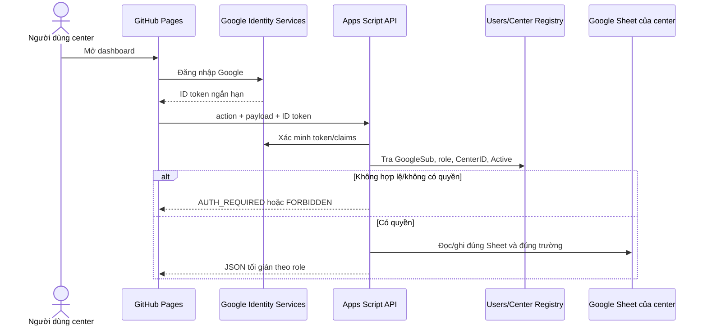

# Kiến trúc bảo mật — Service Center Dashboard

## Quyết định

Giữ GitHub Pages cho giao diện và Google Apps Script cho API, nhưng coi cả URL website lẫn URL Apps Script là công khai. Dữ liệu chỉ được đọc hoặc ghi sau khi Apps Script xác thực Google ID token và phân quyền phía máy chủ.



## Mô hình quyền

| Role | Đọc | Ghi |
|---|---|---|
| `center_editor` | Dữ liệu center được gán | Tạo/cập nhật phiếu center được gán |
| `center_manager` | Dashboard và lỗi dữ liệu của center được gán | Duyệt/chỉnh theo quy trình center |
| `service_manager` | Tất cả center và so sánh tháng | Quản trị center/người dùng, thao tác được cấp riêng |

Một tài khoản có thể được gán nhiều center bằng bảng quan hệ riêng nếu cần. Quyền được xác định từ `GoogleSub` trong token; không dùng email do client tự gửi.

## Hợp đồng request

Frontend chỉ gửi POST qua HTTPS. Không đưa token vào query string.

```json
{
  "action": "ticket.create",
  "idToken": "<Google ID token>",
  "idempotencyKey": "<UUID>",
  "payload": {
    "receivedDate": "2026-09-17",
    "serialNumber": "...",
    "model": "SG...",
    "issue": "..."
  }
}
```

Apps Script xử lý theo thứ tự cố định:

1. Chỉ nhận action trong allowlist.
2. Xác minh token và các claim `aud`, `iss`, `exp`, `email_verified`.
3. Tra `GoogleSub` trong `Users`; kiểm tra `Active`, role và center được gán.
4. Chọn Spreadsheet ID từ registry phía máy chủ.
5. Kiểm tra schema và payload; bỏ mọi trường ngoài whitelist.
6. Với thao tác ghi, lấy script lock, kiểm tra `idempotencyKey` và `rowVersion`, rồi ghi dữ liệu và AuditLog.
7. Trả JSON đã tối giản; không trả stack trace hoặc chi tiết cấu hình.

## Cấu hình phía máy chủ

Script Properties lưu các giá trị cấu hình, không commit vào GitHub:

- `GOOGLE_WEB_CLIENT_ID`
- `CENTER_REGISTRY_SPREADSHEET_ID`
- `ENVIRONMENT`
- phiên bản schema

Registry center lưu `CenterID`, tên hiển thị, Spreadsheet ID, trạng thái hoạt động, timezone và ngày bắt đầu. Registry người dùng lưu `GoogleSub`, email, role, center và trạng thái hoạt động. Chỉ tài khoản quản trị hệ thống có quyền mở hai registry này.

## Bảo vệ thao tác ghi

- TicketID được Apps Script tạo; client không tự cấp mã cuối cùng.
- `LockService.getScriptLock()` bao quanh đoạn kiểm tra phiên bản và ghi.
- Mỗi bản ghi có `CreatedAt`, `CreatedBySub`, `UpdatedAt`, `UpdatedBySub`, `RowVersion`.
- Mỗi request ghi có `idempotencyKey`; key đã xử lý trả lại kết quả cũ.
- Cập nhật yêu cầu `RowVersion` hiện tại; sai phiên bản trả `CONFLICT` để người dùng tải lại.
- AuditLog là append-only. Giao diện chỉ soft-delete/đóng phiếu; không xóa vật lý.
- Giới hạn số request theo `GoogleSub` bằng CacheService để giảm gửi lặp. Đây là lớp bảo vệ bổ sung, không thay thế hạ tầng chống DDoS.

## Dữ liệu trả về dashboard

Endpoint tổng quan chỉ trả số liệu tổng hợp và danh sách phiếu tối thiểu theo role. Các trường như tên/số điện thoại khách hàng, địa chỉ chi tiết, ghi chú nội bộ, tài liệu đính kèm, Spreadsheet ID và lịch sử audit không xuất hiện trong response thông thường.

Cache dùng khóa có phạm vi, ví dụ `dashboard:v1:service_manager:all:2026-09` hoặc `dashboard:v1:center_editor:DAT:2026-09`. Không dùng một response toàn hệ thống chung cho mọi role.

## Tiêu chí kiểm thử trước khi dùng dữ liệu thật

- Không token, token giả, token hết hạn và `aud` sai đều không nhận dữ liệu.
- Tài khoản bị vô hiệu hóa mất quyền ngay cả khi biết endpoint.
- Tài khoản DAT không đọc/ghi được dữ liệu XBSolar/BKE bằng cách đổi payload.
- `center_editor` không gọi được action quản trị.
- Gửi lại cùng `idempotencyKey` không tạo phiếu thứ hai.
- Hai bản sửa cùng `RowVersion` chỉ một bản thành công.
- Response và log không chứa token, Spreadsheet ID hoặc dữ liệu ngoài allowlist.
- Cache của role/center này không được trả cho role/center khác.
- AuditLog truy được ai đã thay đổi phiếu nào và lúc nào.

## Khi nào cần nâng cấp backend

Chuyển từ Apps Script sang Cloud Run/Cloud Functions + Firebase Authentication khi dữ liệu chứa thông tin khách hàng nhạy cảm, cần kiểm soát CORS/status code/rate limit chặt, có nhiều người dùng ngoài hệ sinh thái Google, hoặc lưu lượng ghi bắt đầu chạm quota Apps Script. GitHub Pages và cấu trúc Google Sheets có thể giữ nguyên trong lần nâng cấp đó.
